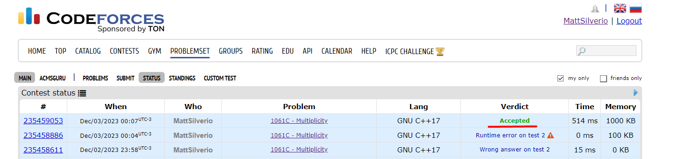
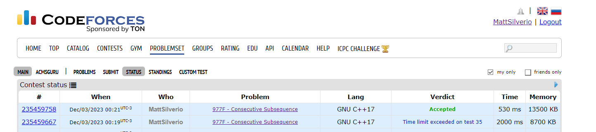

# Exercícios Resolvidos

**Conteúdo da Disciplina**: Programação Dinâmica 

## Alunos
|Matrícula | Aluno |
| -- | -- |
| 15/0154348  | Matheus Phillipo Silverio Silva |
| 19/0134810  |  Shaíne Aparecida Cardoso de Oliveira |

## Sobre 
O repositório contém soluções para algumas questões de juíz online do LeetCode e CodeForces
- [Minimum ASCII Delete Sum for Two Strings](https://leetcode.com/problems/minimum-ascii-delete-sum-for-two-strings/description/)

- [Multiplicity](https://codeforces.com/problemset/problem/1061/C)

- [Consecutive Subsequence](https://codeforces.com/problemset/problem/977/F) 

- [Pizza With 3n Slices](https://leetcode.com/problems/pizza-with-3n-slices/description/)

## Screenshots e Apresentações
- Minimum ASCII Delete Sum for Two Strings

- Multiplicity

- Consecutive Subsequences

- Pizza With 3n Slices  

## Link das apresentações

Para maior conforto, as apresentações estão no youtube. Mas caso não consiga acessa-las, os vídeos se encontram na pasta apresentacoes

- [Minimum ASCII Delete Sum for Two Strings e Apresentação Pizza With 3n Slices](https://youtu.be/ZjzrRMdqewk)

## Instalação 
**Linguagem**: C++ 

## Uso 
Para rodar os algoritmos deste repositório, siga as etapas abaixo:

- Certifique-se de ter um compilador para C++ instalado em sua máquina, recomendamos o g++.
- Faça o clone do repositório Git para o seu ambiente local.
- Compile o arquivo desejado com `g++ -o <nome-do_executavel> <nome-do-arquivo.cpp>`
- Execute o arquivo com `./<nome-do-executavel>`. Certifique-se de que esteja no diretório correto em seu terminal para executar os comandos acima.
- Opcional: Deixamos os arquivos de entrada dos casos de testes de exemplo dos problemas em cada problema, afim de reduzir o tempo de digitação. Ao executar o programa, execute `./<nome-do-executavel> < <nome-do-arquivo-de-input>.txt` 

